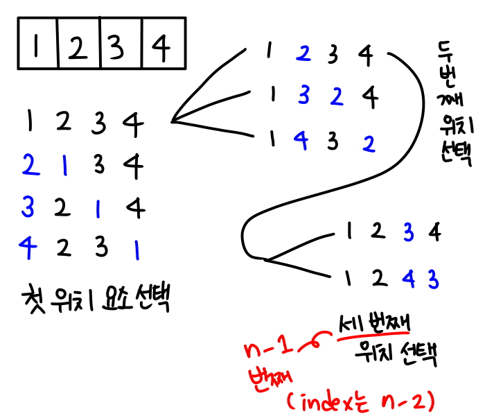
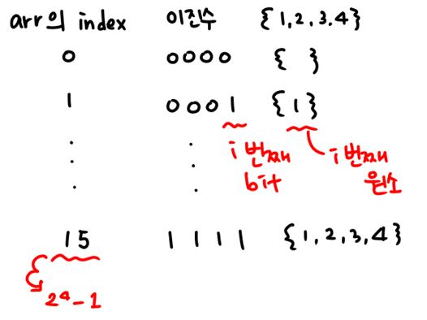

# 조합적 문제


## 완전 검색

많은 종류의 문제가 "특정 조건"을 만족하는 경우나 요소 찾는 검색

Permutation (순열), Combination (조합), Subset (부분집합)과 같은 Combinational Problems (조합적 문제들)과 관련있음 : 완전검색은 조합적 문제에 대한 Brute-force

==n이 12이하일 경우에만 사용하자==


## 순열 (Permutation)

### 순열

> 서로 다른 것들 중 몇 개를 뽑아서 한 줄로 나열

서로 다른 것들 n개 중 r개를 택하는 순열 `nPr`

`nPr` = `n*(n-1)*....(n-r+1)` = `n! / r!`

`nPn` = `n!`

예를 들어, {1, 2, 3, 4} 카드의 배열의 종류?

`4*3*2*1` 

--> 즉 다수 문제가, "순서화"된 요소들의 집합에서 최선의 방법을 찾는 것과 관련있음.

- ex) "출발 도시"에서 "모든 도시"를 "단 한 번"만 방문하고 출발 도시로 돌아오는 최소비용 구하는 문제

- 그러나 위의 문제에서 도시가 n개일 때 가능한 경로는 n! 이므로, n > 12 일 경우에는 시간 복잡도가 폭발적으로 증가함 (12! = 479001600) 고로 **n이 12 보다 크면 다른 방법을 찾아보자.**

  

#### 순열 생성하는 방법

> for 문을 이용하기

````python
for num1 in range(10):
    for num2 in range(10):
        for num3 in range(10):
            print(num1, num2, num3)
````

--> 순열 생성 시 필요한 요수의 수가 고정되지 않는다면 사용하기 어려우므로, 대부분 for문보단 재귀 호출을 이용하여 필요한 횟수만큼 호출하여 구현함.


> 사전적 순서 (Lexicographic-Order)

- 요소들이 오름차순으로 나열된 형태로 시작하는 순열
- {1, 2, 3} {1, 3, 2} {2, 1, 3} {2, 3, 1} {3, 1, 2} {3, 2, 1}


> 변경 횟수가 적은 순서 (Minimum-exchange requirement)

- 최소의 작업으로 순열을 생성하기 위함

- 이전의 상태에서 두 개의 요소들을 교환하여 생성

- {`1`, 2, `3`} {`3`, `2`, 1} {2, `3`, `1`} {`2`, 1, `3`} {`3`, `1`, 2} {1, 3, 2}

  

  

> Johnson-Trotter Algorithm : Minimum-exchange requirement 임!

- 하나의 순열에서 두 개의 요소를 교환, 교환되는 요소는 점과 선으로 연결.

  순서대로 표시하다보면 패턴이 생김 (1950년대 교회의 종소리 패턴과 유사함)

- 하다보면 결국 처음 순열로 돌아오게 되서 마지막을 알 수 있음


>  두 원소의 교환을 통해 생성

- N개의 요소가 있을 때 N번의 선택으로 순열 생성

1. 첫 번째 위치와 나머지 위치 교환하면서 첫 위치 요소 선택

2. 두 번째 위치와 나머지 위치 교환하면서 두 번째 위치 요소 선택

3. n-1 번째 위치와 나머지 위치 교환하면서 n-1 번쨰 위치 요소 선택

4. 3번까지하면 모든 경우의 수 저장되어 있음

   

- 결국 요소가 n 개의 경우 높이가 n인 트리 구조를 갖는다.

  --> 따라서 재귀 순회하듯, 재귀호출을 통해 순열 생성!

  ```python
  a = [1,2 3] 
  def permutation(n, k): #n: 원소의 개수, k: 현재까지 선택된 원소의 수
      if k==n: # 트리의 단말 == 하나의 순열 생성 완료!
          print(a)
      else:
          for i in range(k, n):
              a[k], a[i] = a[i], a[k]
              permutation(n, k+1)
              a[k], a[i] = a[i], a[k] # 맨 첫 요소를 기준으로 위치를 바꿔가는 것이므로, 제자리로 돌려놓는 작업 필수!!
  ```

  


### 라이브러리 이용 

- import itertools
- 리턴 값으로 오브젝트를 얻을 수 있어, 이를 list 혹은 반복문을 통해 출력 가능

#### 순열 

```python
import itertools
mylist = [1,2,3]
result = itertools.permutations(mylist) 
# itertools.permutations(array, r) 의 형태지만, r이 생략될 경우 리스트의 크기가 default값으로 설정됨
print(list(result))
```

- itertools.permutation(array,r) // r==len(array) 일 때 생략 가능


#### 중복순열 

> 동일한 원소 뽑는 것, 즉 중복이 허용되는 순열

````python
import itertools
mylist = [1,2,3]
result = itertools.product(mylist, repeat=3)
print(list(result))
````

- itertools.product(arr, repeat=r) // repeat 역시 생략시 기본값 사용


### 부분집합

#### 부분집합

- 집합에 포함된 원소들을 선택하는 것
- 다수의 중요 알고리즘들이 조건을 만족하는 "최적의 부분 집합"을 찾는 것임
- ex) knapsack problem (냅색 문제, 배낭 문제)
  1. 배낭의 물건들의 집합이 주어짐
  2. 배낭은 무게가 있고, 아이템들은 무게와 가치가 있음
  3. 물건의 총합이 배낭의 무게를 초과하지 않으면 가치의 합이 최대가 되는 물건 선택

> N 개의 원소를 포함한 집합

- 자기 자신과 공집합을 포함한 모든 집합 (Power set)의 개수는 2^n^ 개
- 이유는 모든 원소가 각각 존재하고 (1) 하지않고 (0) 두 가지 상태를 갖기 때문


#### 부분집합을 만드는 알고리즘

> 비트 표현을 통해 for 문으로 부분집합 생성

```python
arr = [2,3,4,5]
bit = [0]*len(arr) # 각 원소가 포함되는 지 안되는지 저장할 bit list
for i in range(2):
    bit[0] = i
    for j in range(2):
        bit[1] = j
        for k in range(2):
            bit[2] = k
            for l in range(2):
                bit[3] = l
                print([arr[x] for x in range(len(bit)) if bit[x])
                # bit[x] 가 1 이면 그 원소를 리스트에 넣어 출력
```


> Binary Counting을 통한 Lexicographic Order(사전적 순서)
>
> : 비트 표현을 이용한 방법 중 가장 쉬운 방법

- 부분집합을 생성하기 위한 가장 단순한 방법이면서

- 사전적 순서로 생성할 때도 가장 간단한 방법! 

- 만들 수 있는 부분 집합의 개수 2^n^ 개의 배열에 저장함

  

  

- binary counting을 이용한 부분집합 생성 코드

  ```python
  arr = [2,3,4,5]
  n = len(arr)
  
  for i in range(1<<n): # 1 << n 은 부분집합의 개수 2^n 개이다
      for j in range(n): # 원소의 수만큼 비트를 표현!
          if i & (1 << j): # i의 j번째 비트가 1이면 j번째 원소 출력
              print(arr[j], end=",")
          print()
  ```

  

  다음처럼 줄여쓰는 것도 가능함.

  ```python
  arr = [2,3,4,5]
  for i in range(1<<len(arr)):
      print([arr[j] for in range(len(arr)) if i & (1 << j)])
  ```


## 조합 (Combination)

### 조합

서로 다른 n개의 원소 중 ==순서없이== r개를 골라낸 것 : `nCr`

`nCr` = `nPr/r!` = `n!/((n-r)!*r!)` (n >= r)

n개에서 r개를 순서있게 꺼내면 nPr 인데, 이 때 순서에 해당하는 r!를 다시 나눠준 것

- `nC0` = `1`  / `nCn` = `1`

- `nCr` = `nCn-r`

- `nCr` = `n-1Cr-1` + `n-1Cr` : 얘가 꽤 중요! 파스칼 삼각형, 재귀적 표현!

  이게 되는 이유?

  1. n개에서 r개를 택하는 것은  `nCr`
  2. 특정하나(a)를 포함한 경우 - 나머지에서 r-1 개 뽑으면 됨 `n-1Cr-1`
  3. 특정하나(a)를 포함하지 않는 경우 - 나머지에서 r 개 뽑아야함 `n-1Cr`
  4. 두 가지 경우를 합한 것! `nCr` = `n-1Cr-1` + `n-1Cr`
  5. ex) {1, 2, 3, 4} 에서 1를 꼭 포함한 부분집합과 1을 포함하지 않은 부분집합 = 모든 부분집합

#### 조합을 생성하는 방법

> 재귀 호출을 이용

```python
arr_n = [1,2,3,4,...] # n개의 원소를 갖는 list
temp_r = [0]*r # 조합이 임시 저장될 r 크기의 list

def comb(n, r):
    if r==0:
        print(tr)
    elif n < r:
        return
    else:
        temp_r[r-1]=arr_n[n-1]
        # temp_r은 크기가 r이므로 r개 만큼 원소가 저장됨
        # 즉 temp_r이 r개를 중복없이 뽑은 부분집합
        comb(n-1, r-1)
        comb(n-1, r)
        # arr_n = [A,B,C,D,E] 라면
        # comb(n-1, r-1)만을 통해 C,D,E 먼저 출력되고
        # 그다음 B,D,E ... A,B,E 까지 출력되고 return
        
        # 단, 여기까지는 arr_n[n-1]이 필수로 들어가는 것들만 출력되므로
        # comb(n-1, r) (n-2, r)... (r+1, r) 들도 각각 호출해주어야함.
```


